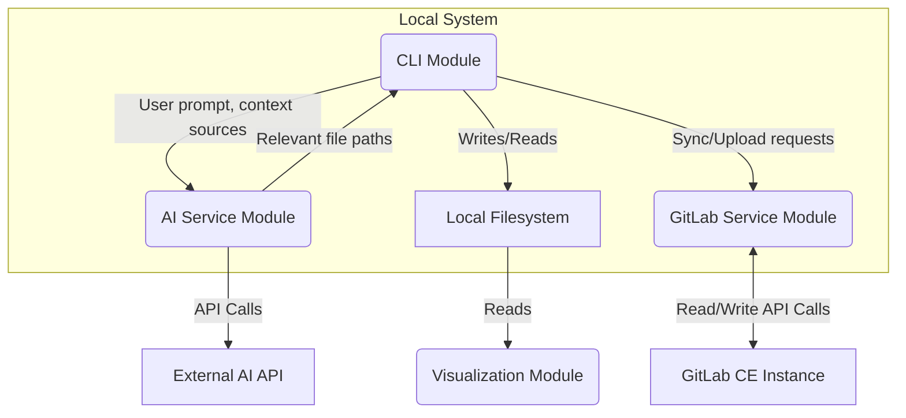

# Architecture Design Document (ADD)

## 1. Introduction

This document describes the overall architecture and system design for the GitLab AI Assistant project, focusing on the synchronization component.

## 2. System Overview

The system is composed of three primary logical components:

1.  **CLI Module (`gemini_cli.py`):** A Python-based command-line tool that serves as the main user interface. It orchestrates the different services like synchronization and AI-powered analysis.
2.  **GitLab Service Module (`gitlab_service.py`):** Responsible for all communication with the GitLab API, including fetching data and uploading new entities.
*   **AI Service Module (`ai_service.py`):** A dedicated module for handling all interactions with external AI APIs (e.g., Google Gemini). Its design has been significantly updated to enhance security, reliability, and configurability.
    *   **Schema-Enforced Structured Output:** To eliminate the fragility of parsing JSON from raw text, the system now uses the Gemini API's structured output feature. For each type of AI request, a rigid JSON schema is defined manually as a Python dictionary, ensuring 100% compatibility. The API call is configured to enforce this schema, guaranteeing a valid JSON response.
    *   **Pydantic for Response Validation:** After receiving the guaranteed JSON response, it is parsed into a Pydantic model. This validates the data types, checks for required fields, and ensures data integrity before it is used by the rest of the application.
    *   **Content Safety Settings:** All API calls are configured with default safety settings set to `BLOCK_MEDIUM_AND_ABOVE` for all major harm categories.
    *   **Configurable Models:** Model names are externalized to `config.py` and can be overridden by environment variables (`GEMINI_SMART_MODEL`, `GEMINI_FAST_MODEL`).
    *   **Prompt Injection Mitigation:** The service strictly separates system instructions from user-provided data using the API's message-based structure (`role: 'model'` vs. `role: 'user'`)
4.  **Visualization Module (External):** An external, file-system-aware tool (e.g., Obsidian) that consumes the generated Markdown files for visualization.

## 3. Architectural Decisions

*   **Modular Service Layer:** The core logic is separated into distinct services (`gitlab_service`, `ai_service`) to ensure a clean separation of concerns, making the system easier to test, maintain, and extend.
*   **Hybrid Synchronization Model:** The system is primarily based on a one-way sync (GitLab -> Local) for consuming and analyzing the project state. However, it includes a 'write-back' capability specifically for new entities (labels, issues, comments) generated via the AI assistant. This allows the tool to not just analyze but also contribute to the GitLab project, while avoiding the complexity of a full bidirectional sync.
*   **File-Based Storage:** Markdown files with YAML frontmatter are chosen for their human-readability, version control friendliness, and compatibility with various text editors and knowledge management tools.
*   **Python for Backend:** Python is selected due to its rich ecosystem, strong support for API interactions (`python-gitlab`), and rapid development capabilities.
*   **`uv` and `pyproject.toml`:** For modern, efficient, and reproducible Python dependency and environment management.
*   **Configuration Management:** Sensitive information (GitLab URL, Private Token) is externalized into a `.gitignore`-d `.env` file.
*   **Hierarchy via Issue Links:** To ensure a scalable and robust representation of the project hierarchy, the relationship between Epics and Stories is defined using GitLab's native "Related items" feature (API: Issue Links). This approach avoids cluttering the label system and provides a more explicit and maintainable way to manage parent-child relationships compared to the previous label-based convention.

## 4. Component Diagram



## 5. Data Flow

1.  The **CLI Module** receives a command from the user (e.g., `create feature`).
2.  The CLI Module calls the **GitLab Service Module** to perform a "smart sync" to ensure the local data is up-to-date.
3.  The CLI Module gathers all potential context sources (documentation, existing issues from the local filesystem).
4.  The CLI Module passes the user's request and the context sources to the **AI Service Module**.
5.  The **AI Service Module** constructs a prompt, sends it to the **External AI API**, and parses the response to get a list of relevant files.
6.  This list is returned to the **CLI Module**, which then proceeds with the next steps of the workflow (e.g., deep analysis, user dialogue).
7.  When new issues are finalized, the **CLI Module** instructs the **GitLab Service Module** to upload them to the **GitLab CE Instance**.
8.  The **Visualization Module** can independently read the data from the **Local Filesystem** at any time.

## 6. Directory Structure

```
/workspaces
├── src/                     # Source code for the gemini-gitlab-workflow package
│   └── gemini_gitlab_workflow/
│       ├── __init__.py      # Marks the directory as a Python package
│       ├── ai_service.py    # AI interaction service
│       ├── config.py        # Centralized configuration system
│       ├── gemini_cli.py    # Command-line interface (CLI)
│       ├── gitlab_service.py# GitLab API interaction service
│       └── sync_gitlab.py   # Main synchronization logic
├── tests/                   # Unit and integration tests
│   ├── conftest.py          # Pytest configuration
│   ├── test_ai_service.py
│   ├── test_gemini_cli.py
│   ├── test_gitlab_service.py
│   └── test_sync_gitlab.py
├── gitlab_data/             # Synchronized GitLab data (Markdown files)
│   ├── backbones/
│   │   └── <backbone_name>/
│   │       └── <epic_name>/
│   │           ├── epic.md
│   │           └── story-<story_name>.md
├── docs/                    # Project documentation
│   ├── architecture-design-document.md
│   ├── backlog.md
│   ├── product-requirements-document.md
│   ├── software-requirements-specification.md
│   └── technical-design-document.md
├── pyproject.toml           # Project metadata and dependencies (uv)
├── README.md                # Top-level project overview
├── GEMINI.md                # Project-specific Gemini rules and guidelines
└── .gitignore               # Git ignore rules
```

---

## 7. Project Automation: The `gemini-gitlab-workflow` Package

The project's automation and GitLab integration capabilities have been refactored from a collection of simple scripts into a professional, standalone Python package. This provides a robust, maintainable, and extensible foundation for all workflow automation tasks.

### 7.1. High-Level Summary: From Scripts to a Package

The most significant change is the evolution of the `scripts` folder into a formal, installable Python package named `gemini-gitlab-workflow`. This package includes a dedicated Command-Line Interface (CLI), accessible via the `ggw` (Gemini GitLab Workflow) command, which exposes the entire functionality of the tool. This structure is more robust, maintainable, and scalable than the previous script-based approach.

### 7.2. Key Architectural Changes

*   **Centralized Configuration (`config.py`):** A new hierarchical configuration system has been introduced. It loads settings in the following order of precedence: default values -> global user config (`~/.config/gemini_workflows/config.yaml`) -> project-specific config (`.gemini-workflow.yaml`). This eliminates hardcoded paths and secrets, making the tool portable and secure.

*   **Structured Command-Line Interface (`cli.py`):** Built with the `Typer` library, the `ggw` command provides a modern, user-friendly CLI. It is organized into logical subcommands:
    *   `ggw create-feature`: The main AI-driven workflow for planning new features.
    *   `ggw sync map`: Synchronizes data from GitLab and builds the local project map.
    *   `ggw upload story-map`: Uploads the locally generated plans and issues back to GitLab.

*   **Modular Services (`gitlab_service.py`, `ai_service.py`):** The core logic is now separated into distinct service modules. The `gitlab_service` handles all communication with the GitLab API, using the central configuration for credentials. It now leverages GitLab's "Issue Links" feature for more reliable hierarchy management between Epics and Stories.

*   **Formal Packaging (`pyproject.toml`):** This file defines the project as an installable Python package, specifying its metadata, dependencies, and the `ggw` command as its entry point.

### 7.3. The Core Workflow: `ggw create-feature`

This command orchestrates the complete AI-assisted feature planning process:

1.  **Sync:** It starts by updating the local data cache from GitLab.
2.  **Context Gathering:** It reads the project's `/docs` folder and existing GitLab issues to build a comprehensive understanding of the project's current state.
3.  **AI-Powered Filtering:** The AI service identifies the most relevant documents and issues based on the user's high-level feature description.
4.  **AI-Powered Planning:** The content of these relevant files is sent to the AI, which generates a detailed implementation plan broken down into new Epics and Stories.
5.  **User Approval:** The generated plan is presented to the user for confirmation before any files are created.
6.  **Local File Generation:** Upon approval, the tool creates the corresponding local `.md` files for each new issue in the appropriate directory structure.

### 7.4. Installation and Gemini CLI Integration (`setup.sh`)

The `setup.sh` script automates the entire setup process:

1.  **Package Installation:** It installs the `gemini-gitlab-workflow` package, making the `ggw` command available system-wide.
2.  **Configuration:** It creates the necessary global configuration directory and a template file for the user to add their GitLab token.
3.  **Gemini CLI Integration:** Crucially, the script registers the package's capabilities as a custom tool for the Gemini CLI by copying `gemini_tools.py` into the `~/.gemini/custom_tools` directory. This allows the Gemini assistant to invoke the workflow commands directly.
