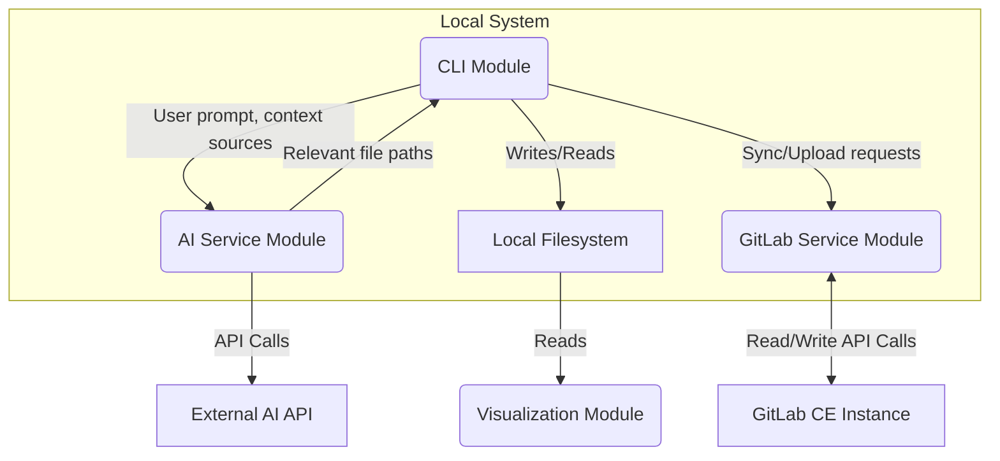

# Architecture Design Document (ADD)

## 1. Introduction

This document describes the overall architecture and system design for the GitLab AI Assistant project, focusing on the synchronization component.

## 2. System Overview

The system is composed of three primary logical components:

1.  **CLI Module (`gemini_cli.py`):** A Python-based command-line tool that serves as the main user interface. It orchestrates the different services like synchronization and AI-powered analysis.
2.  **GitLab Service Module (`gitlab_service.py`):** Responsible for all communication with the GitLab API, including fetching data and uploading new entities.
3.  **AI Service Module (`ai_service.py`):** A dedicated module for handling all interactions with external AI APIs (e.g., Google Gemini). It is responsible for prompt engineering, making API calls, and parsing the results.
4.  **Visualization Module (External):** An external, file-system-aware tool (e.g., Obsidian) that consumes the generated Markdown files for visualization.

## 3. Architectural Decisions

*   **Modular Service Layer:** The core logic is separated into distinct services (`gitlab_service`, `ai_service`) to ensure a clean separation of concerns, making the system easier to test, maintain, and extend.
*   **Hybrid Synchronization Model:** The system is primarily based on a one-way sync (GitLab -> Local) for consuming and analyzing the project state. However, it includes a 'write-back' capability specifically for new entities (labels, issues, comments) generated via the AI assistant. This allows the tool to not just analyze but also contribute to the GitLab project, while avoiding the complexity of a full bidirectional sync.
*   **File-Based Storage:** Markdown files with YAML frontmatter are chosen for their human-readability, version control friendliness, and compatibility with various text editors and knowledge management tools.
*   **Python for Backend:** Python is selected due to its rich ecosystem, strong support for API interactions (`python-gitlab`), and rapid development capabilities.
*   **`uv` and `pyproject.toml`:** For modern, efficient, and reproducible Python dependency and environment management.
*   **Configuration Management:** Sensitive information (GitLab URL, Private Token) is externalized into a `.gitignore`-d `.env` file.
*   **Hierarchy via Issue Links:** To ensure a scalable and robust representation of the project hierarchy, the relationship between Epics and Stories is defined using GitLab's native "Related items" feature (API: Issue Links). This approach avoids cluttering the label system and provides a more explicit and maintainable way to manage parent-child relationships compared to the previous label-based convention.

## 4. Component Diagram



## 5. Data Flow

1.  The **CLI Module** receives a command from the user (e.g., `create feature`).
2.  The CLI Module calls the **GitLab Service Module** to perform a "smart sync" to ensure the local data is up-to-date.
3.  The CLI Module gathers all potential context sources (documentation, existing issues from the local filesystem).
4.  The CLI Module passes the user's request and the context sources to the **AI Service Module**.
5.  The **AI Service Module** constructs a prompt, sends it to the **External AI API**, and parses the response to get a list of relevant files.
6.  This list is returned to the **CLI Module**, which then proceeds with the next steps of the workflow (e.g., deep analysis, user dialogue).
7.  When new issues are finalized, the **CLI Module** instructs the **GitLab Service Module** to upload them to the **GitLab CE Instance**.
8.  The **Visualization Module** can independently read the data from the **Local Filesystem** at any time.

## 6. Directory Structure

```
/workspaces
├── gitlab_data/             # Synchronized GitLab data (Markdown files)
│   ├── backbones/
│   │   └── <backbone_name>/
│   │       └── <epic_name>/
│   │           ├── epic.md
│   │           └── story-<story_name>.md
├── scripts/                 # Python synchronization scripts
│   ├── config.py            # GitLab API configuration (ignored by git)
│   ├── pyproject.toml       # Python project dependencies (uv)
│   ├── README.md            # Script usage instructions
│   ├── sync_gitlab.py       # Main synchronization script
│   └── tests/               # Unit and integration tests for scripts
├── docs/                    # Project documentation
│   ├── architecture-design-document.md
│   ├── backlog.md
│   ├── product-requirements-document.md
│   ├── software-requirements-specification.md
│   └── technical-design-document.md
├── README.md                # Top-level project overview
├── GEMINI.md                # Project-specific Gemini rules and guidelines
└── .gitignore               # Git ignore rules
```
