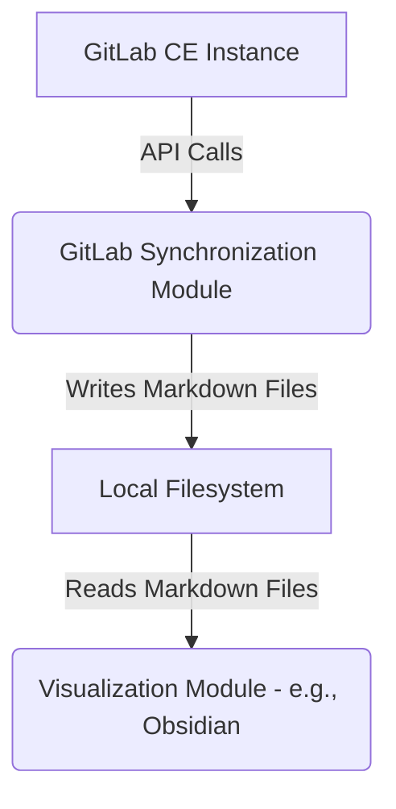

# Architecture Design Document (ADD)

## 1. Introduction

This document describes the overall architecture and system design for the GitLab AI Assistant project, focusing on the synchronization component.

## 2. System Overview

The system is composed of two primary logical components:

1.  **GitLab Synchronization Module:** A Python-based command-line script responsible for connecting to GitLab, fetching data, and transforming it into a local file-based representation.
2.  **Visualization Module (External):** An external, file-system-aware tool (e.g., Obsidian) that consumes the generated Markdown files for visualization.

## 3. Architectural Decisions

*   **One-Way Synchronization:** To maintain simplicity and avoid complex conflict resolution, the synchronization will be strictly one-way (GitLab -> Local Filesystem).
*   **File-Based Storage:** Markdown files with YAML frontmatter are chosen for their human-readability, version control friendliness, and compatibility with various text editors and knowledge management tools.
*   **Python for Synchronization:** Python is selected due to its rich ecosystem, strong support for API interactions (`python-gitlab`), and rapid development capabilities.
*   **`uv` and `pyproject.toml`:** For modern, efficient, and reproducible Python dependency and environment management.
*   **Configuration Management:** Sensitive information (GitLab URL, Private Token) is externalized into a `.gitignore`-d `config.py` file.

## 4. Component Diagram



## 5. Data Flow

1.  The GitLab Synchronization Module initiates a connection to the GitLab API using the provided URL and Private Access Token.
2.  It fetches project details, issues, labels, and milestones.
3.  For each issue, it determines its hierarchical level (Backbone, Epic, Story, Task) based on assigned labels.
4.  It constructs a file path within the `gitlab_data` directory corresponding to the issue's hierarchy.
5.  It generates Markdown content for each issue, including a YAML frontmatter block with metadata and the issue description.
6.  The generated Markdown files are written to the local filesystem.
7.  The Visualization Module reads these Markdown files from the local filesystem to display the project structure.

## 6. Directory Structure

```
/workspaces
├── gitlab_data/             # Synchronized GitLab data (Markdown files)
│   ├── backbones/
│   │   └── <backbone_name>/
│   │       └── epics/
│   │           └── <epic_name>/
│   │               └── stories/
│   │                   └── <story_name>/
│   │                       └── tasks/
│   │                           └── <task_name>.md
├── scripts/                 # Python synchronization scripts
│   ├── config.py            # GitLab API configuration (ignored by git)
│   ├── pyproject.toml       # Python project dependencies (uv)
│   ├── README.md            # Script usage instructions
│   └── sync_gitlab.py       # Main synchronization script
├── docs/                    # Project documentation
│   ├── architecture-design-document.md
│   ├── backlog.md
│   ├── product-requirements-document.md
│   ├── software-requirements-specification.md
│   └── technical-design-document.md
├── README.md                # Top-level project overview
└── .gitignore               # Git ignore rules
```
